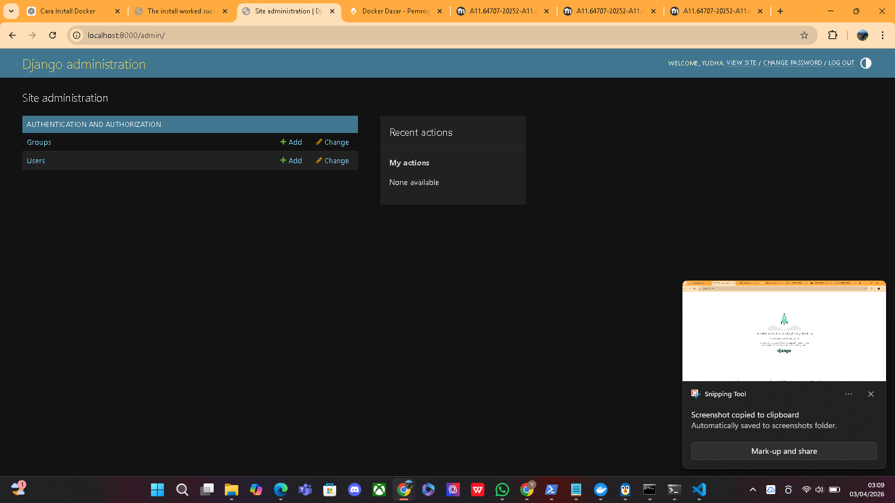

# tugas-1-django-docker
Cara Menjalankan Project
docker compose up -d --build
docker compose exec web python manage.py migrate
docker compose exec web python manage.py createsuperuser

Akses aplikasi:

http://localhost:8000
http://localhost:8000/admin

Environment Variables
DB_NAME=django_db
DB_USER=postgres
DB_PASSWORD=postgres123
DB_HOST=db
DB_PORT=5432

