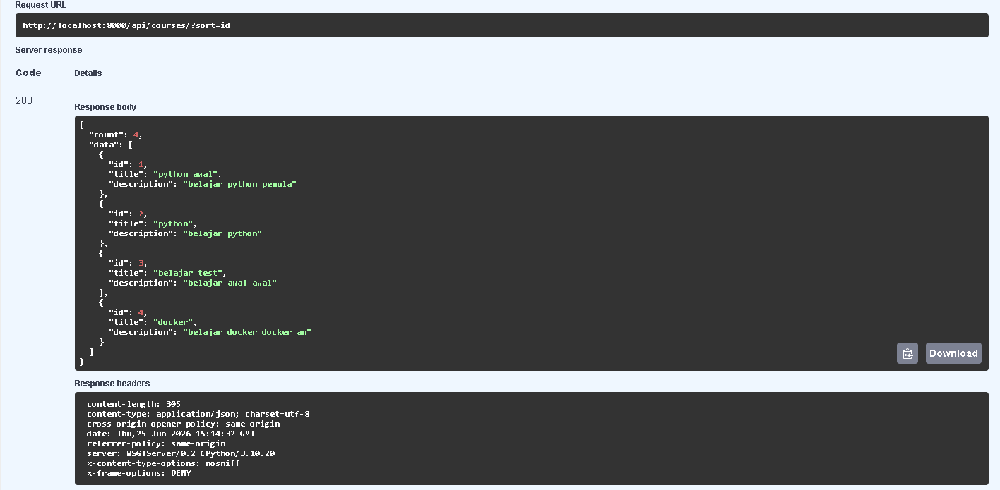
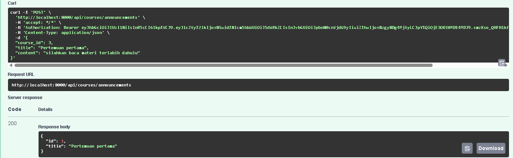
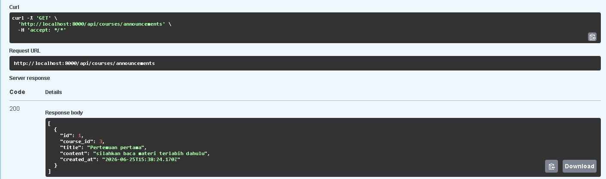
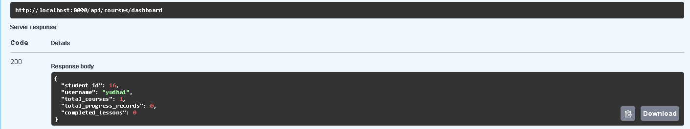
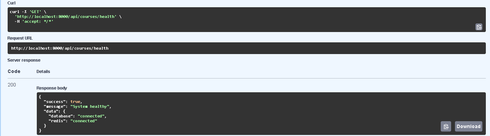

# Project Fitur Tambahan Simple LMS

## Identitas

- Nama        : Yudha Aji Prasetya
- Nim         : A11.2023.15375
- Mata Kuliah : Pemrograman Sisi Server

---

# Komponen Fondasi

## Authentication & Authorization

- JWT Authentication
- Register
- Login
- Profile Management
- Role Based Access Control (RBAC)

Role:

- Admin
- Instructor
- Student

---

## Course Management

- Create Course
- List Course
- Detail Course
- Update Course
- Delete Course

---

## Lesson Management

- Create Lesson
- List Lesson
- Detail Lesson


---

## Enrollment

- Student Enrollment

---

## Progress Tracking

- Menandai lesson selesai
- Monitoring progress belajar

---

# Fitur Tambahan yang Diimplementasikan

## 1. Search / Filter / Sort (12 Poin)

Deskripsi:

Menambahkan kemampuan pencarian dan pengurutan data course menggunakan query parameter.

Contoh:

```http
GET /api/courses?search=python

GET /api/courses?sort=title

GET /api/courses?sort=-title
```



Poin: 12

---

## 2. Course Announcement (10 Poin)

Deskripsi:

Instructor dapat membuat pengumuman untuk course dan dapat dilihat oleh student.

Endpoint:

```http
GET  /api/courses/announcements

POST /api/courses/announcements

GET  /api/courses/announcements/{id}
```




Poin: 10

---

## 3. Student Dashboard (12 Poin)

Deskripsi:

Menampilkan ringkasan aktivitas belajar student.

Informasi:

- Total Course
- Total Progress Record
- Completed Lessons

Endpoint:

```http
GET /api/courses/dashboard
```



Poin: 12

---


## 4. Health Check (8 Poin)

Deskripsi:

Monitoring status service aplikasi.

Pemeriksaan:

- PostgreSQL
- Redis

Endpoint:

```http
GET /api/courses/health
```

Contoh Response:

```json
{
  "status": "ok",
  "database": "connected",
  "redis": "connected"
}
```



Poin: 8

---
## 5. Response Consistent (10 Poin)

Deskripsi:

Menggunakan format response yang konsisten pada endpoint API.

Format:

```json
{
  "success": true,
  "message": "Operation successful",
  "data": {}
}
```


Poin: 10

---

# Kesimpulan

Total fitur tambahan yang berhasil diimplementasikan adalah:

52 poin

Sesuai ketentuan tugas, nilai fitur tambahan maksimal yang dihitung adalah 50 poin, sehingga kebutuhan minimal (30 poin) dan rekomendasi nilai sangat baik (45–60 poin) telah terpenuhi.