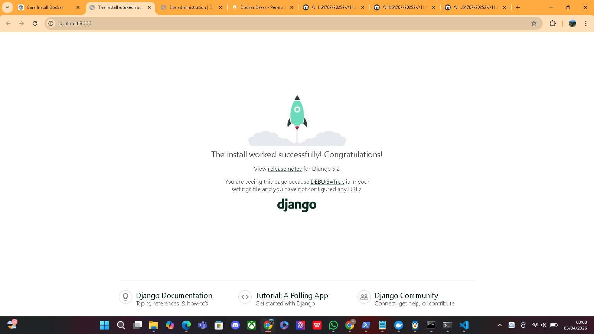

# tugas-1-django-docker
Cara Menjalankan Project
docker compose up -d --build
docker compose exec web python manage.py migrate
docker compose exec web python manage.py createsuperuser

Akses aplikasi:

http://localhost:8000
http://localhost:8000/admin

Environment Variables
DB_NAME=django_db
DB_USER=postgres
DB_PASSWORD=postgres123
DB_HOST=db
DB_PORT=5432

Kenapa perlu volume untuk MySQL?
Agar data database tetap tersimpan dan tidak hilang meskipun container dihentikan atau dihapus.

Apa fungsi depends_on?
Untuk mengatur urutan startup container agar WordPress dijalankan setelah MySQL.

Bagaimana cara WordPress container connect ke MySQL?
Menggunakan environment variables dengan host berupa nama service mysql dalam network Docker.

Apa keuntungan pakai Redis untuk WordPress?
Untuk caching sehingga meningkatkan performa, mempercepat loading, dan mengurangi beban database.
