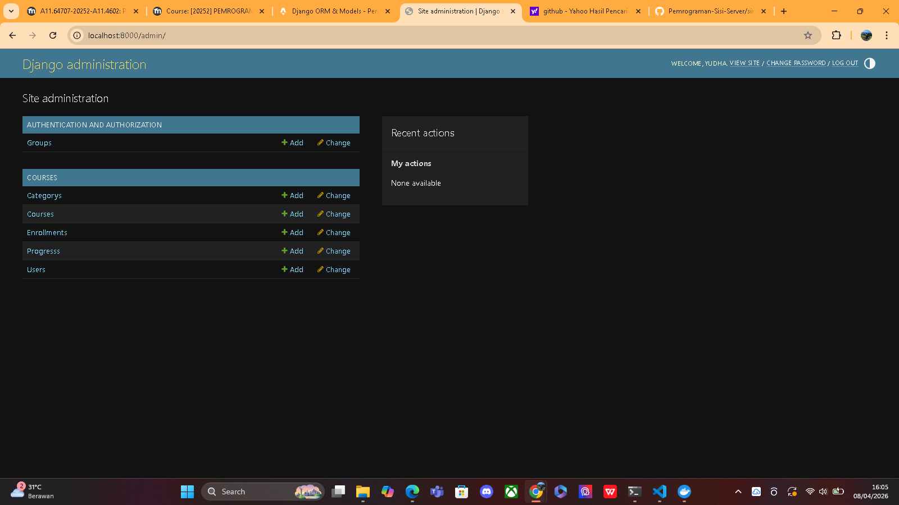
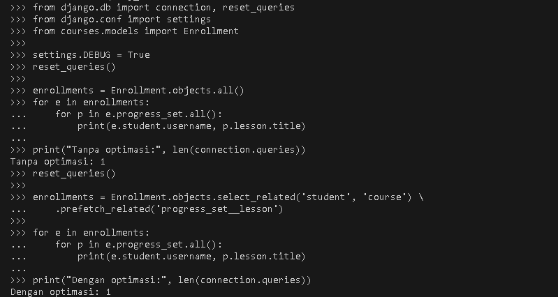

# tugas-1-django-docker
Cara Menjalankan Project
docker compose up -d --build
docker compose exec web python manage.py migrate
docker compose exec web python manage.py createsuperuser

Akses aplikasi:

http://localhost:8000
http://localhost:8000/admin

Environment Variables
DB_NAME=django_db
DB_USER=postgres
DB_PASSWORD=postgres123
DB_HOST=db
DB_PORT=5432


# Progress 2: Simple LMS - Database Design & ORM Implementation

# 🎓 Simple LMS (Learning Management System)

Simple LMS adalah aplikasi berbasis Django yang digunakan untuk mengelola kursus, materi pembelajaran, dan progress siswa.

---

## 🚀 Fitur Utama

- Manajemen User (Admin, Instructor, Student)
- Kategori kursus (hierarchical)
- Manajemen Course & Lesson
- Enrollment siswa ke course
- Tracking progress pembelajaran
- Django Admin interface
- Query optimization (select_related & prefetch_related)

---

## 🧱 Tech Stack

- Python 3
- Django
- PostgreSQL
- Docker & Docker Compose

---

## 📂 Struktur Project
simple-lms/
├── docker-compose.yml
├── Dockerfile
├── requirements.txt
└── code/
├── manage.py
├── config/
├── courses/
└── fixtures/

---

## ⚙️ Cara Menjalankan Project

### 1. Clone Repository

```bash
git clone <repo-url>
cd simple-lms
### 2. Jalankan docker
docker-compose up --build
### 3. Masuk ke Container
docker-compose exec web bash
### 4. Migration
python manage.py makemigrations
python manage.py migrate
### 5. Buat Superuser
python manage.py createsuperuser
### 6. Jalankan Server
python manage.py runserver 0.0.0.0:8000
### 7. Akses Admin
http://localhost:8000/admin

🧩 Data Models
User → role: admin, instructor, student
Category → self-referencing (parent-child)
Course → instructor & category
Lesson → ordered per course
Enrollment → relasi student–course (unique)
Progress → tracking lesson completion

### Screenshots

