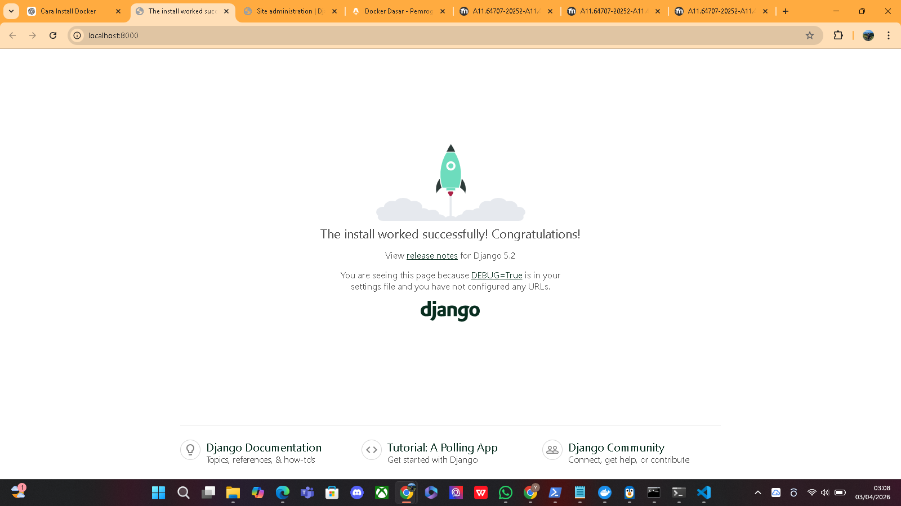
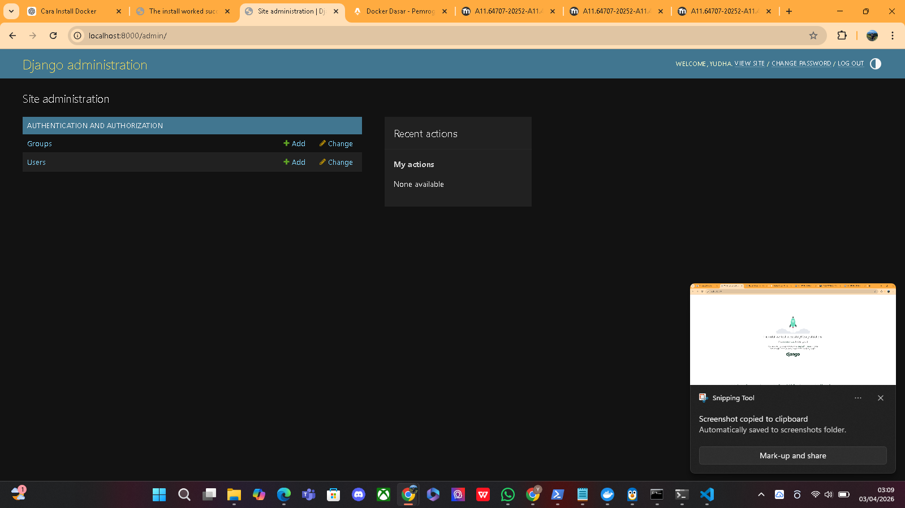
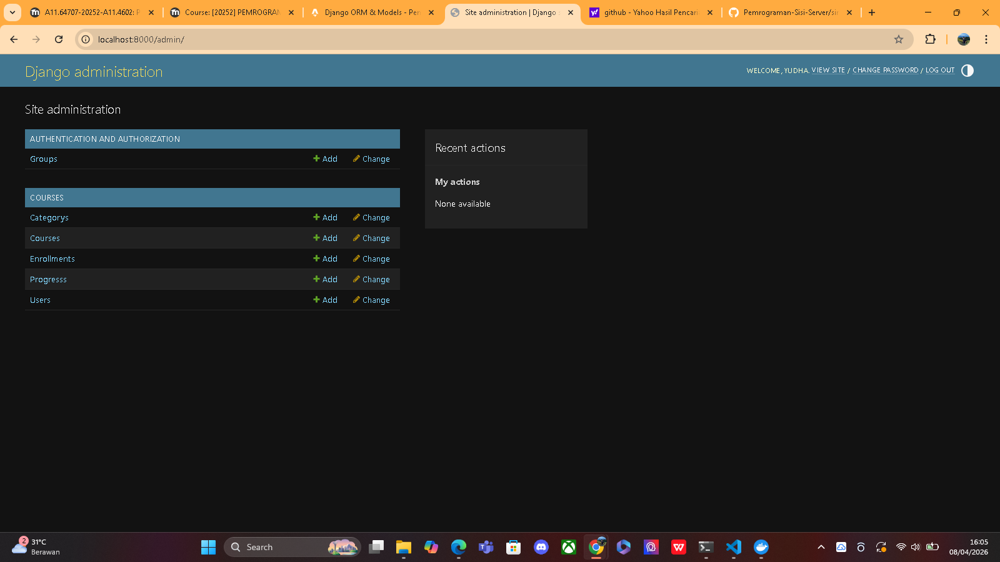
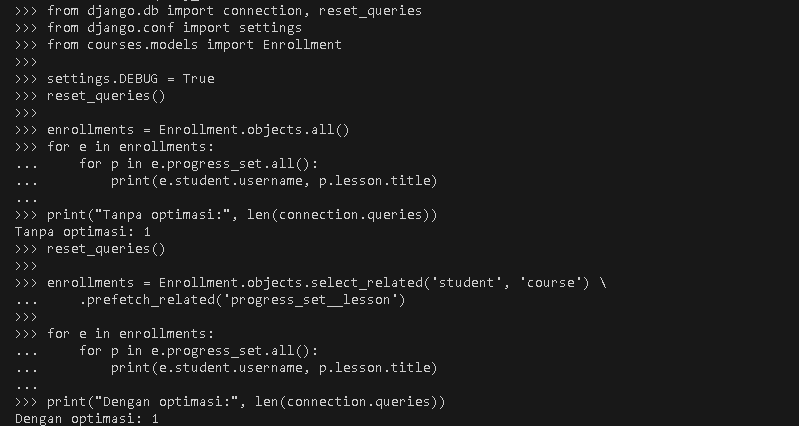
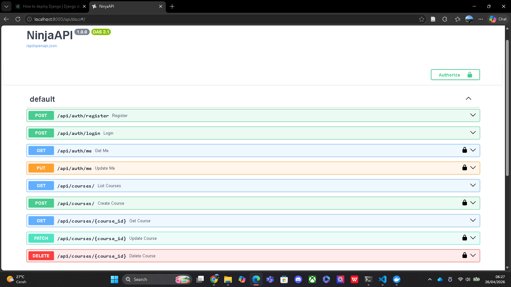
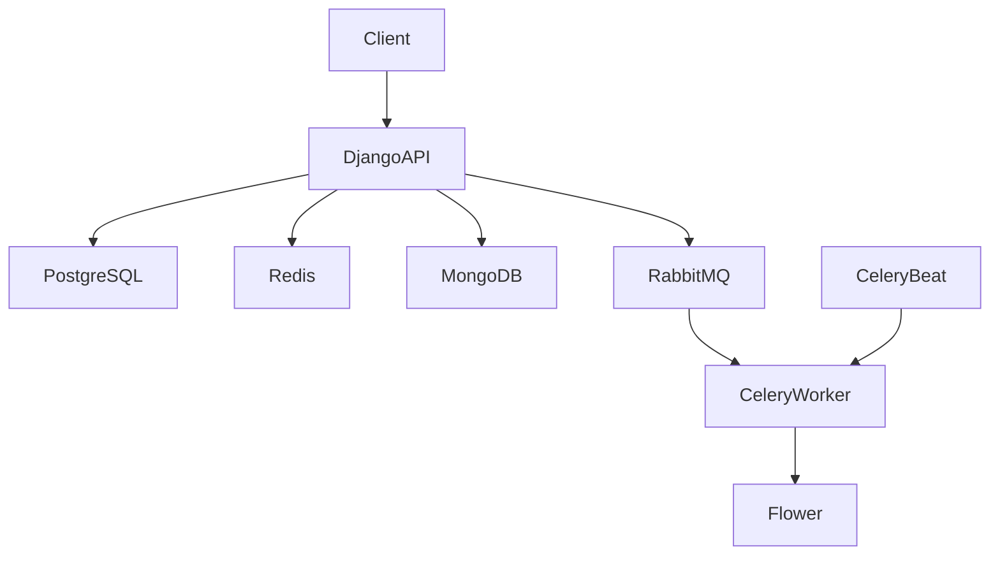

# tugas-1-django-docker
Cara Menjalankan Project
docker compose up -d --build
docker compose exec web python manage.py migrate
docker compose exec web python manage.py createsuperuser

Akses aplikasi:

http://localhost:8000
http://localhost:8000/admin

Environment Variables
DB_NAME=django_db
DB_USER=postgres
DB_PASSWORD=postgres123
DB_HOST=db
DB_PORT=5432




Kenapa perlu volume untuk MySQL?
Agar data database tetap tersimpan dan tidak hilang meskipun container dihentikan atau dihapus.

Apa fungsi depends_on?
Untuk mengatur urutan startup container agar WordPress dijalankan setelah MySQL.

Bagaimana cara WordPress container connect ke MySQL?
Menggunakan environment variables dengan host berupa nama service mysql dalam network Docker.

Apa keuntungan pakai Redis untuk WordPress?
Untuk caching sehingga meningkatkan performa, mempercepat loading, dan mengurangi beban database.
>>>>>>> c0fa9ba390df6f3c536ac491837ca6d077463c50

<<<<<<< HEAD
# Progress 2: Simple LMS - Database Design & ORM Implementation

# 🎓 Simple LMS (Learning Management System)

Simple LMS adalah aplikasi berbasis Django yang digunakan untuk mengelola kursus, materi pembelajaran, dan progress siswa.

---

## 🚀 Fitur Utama

- Manajemen User (Admin, Instructor, Student)
- Kategori kursus (hierarchical)
- Manajemen Course & Lesson
- Enrollment siswa ke course
- Tracking progress pembelajaran
- Django Admin interface
- Query optimization (select_related & prefetch_related)

---

## 🧱 Tech Stack

- Python 3
- Django
- PostgreSQL
- Docker & Docker Compose

---

## 📂 Struktur Project
simple-lms/
├── docker-compose.yml
├── Dockerfile
├── requirements.txt
└── code/
├── manage.py
├── config/
├── courses/
└── fixtures/

---

## ⚙️ Cara Menjalankan Project

### 1. Clone Repository
git clone <repo-url>
cd simple-lms
### 2. Jalankan docker
docker-compose up --build
### 3. Masuk ke Container
docker-compose exec web bash
### 4. Migration
python manage.py makemigrations
python manage.py migrate
### 5. Buat Superuser
python manage.py createsuperuser
### 6. Jalankan Server
python manage.py runserver 0.0.0.0:8000
### 7. Akses Admin
http://localhost:8000/admin

🧩 Data Models
User → role: admin, instructor, student
Category → self-referencing (parent-child)
Course → instructor & category
Lesson → ordered per course
Enrollment → relasi student–course (unique)
Progress → tracking lesson completion

### Screenshots
Admin Dashboard


Query Demo

=======
<<<<<<< HEAD
Kenapa perlu volume untuk MySQL?
Agar data database tetap tersimpan dan tidak hilang meskipun container dihentikan atau dihapus.

Apa fungsi depends_on?
Untuk mengatur urutan startup container agar WordPress dijalankan setelah MySQL.

Bagaimana cara WordPress container connect ke MySQL?
Menggunakan environment variables dengan host berupa nama service mysql dalam network Docker.

Apa keuntungan pakai Redis untuk WordPress?
Untuk caching sehingga meningkatkan performa, mempercepat loading, dan mengurangi beban database.
>>>>>>> c0fa9ba390df6f3c536ac491837ca6d077463c50

Progress 3 Simple LMS API (Django Ninja + JWT)
Deskripsi

Proyek ini adalah sistem Learning Management System (LMS) berbasis REST API menggunakan Django Ninja dengan autentikasi JWT dan role-based access control.

Tech Stack
Python
Django
Django Ninja
JWT (JSON Web Token)
SQLite / PostgreSQL (opsional)
Postman untuk testing API
Fitur
Authentication
Register user
Login (JWT access token)
Get current user (/me)
Update profile (/me)
Courses

Public

GET /api/courses (list courses)
GET /api/courses/{id} (detail course)

Protected

POST /api/courses (create course - instructor)
PATCH /api/courses/{id} (update course - owner)
DELETE /api/courses/{id} (admin)
Authentication System
JWT access token
Password hashing menggunakan Django
Role: admin, instructor, student
Permission System
require_role decorator untuk membatasi akses endpoint
Validasi ownership untuk update course
API Endpoints
Authentication
POST /api/auth/register
POST /api/auth/login
GET /api/auth/me
PUT /api/auth/me
Courses
GET /api/courses
GET /api/courses/{id}
POST /api/courses
PATCH /api/courses/{id}
DELETE /api/courses/{id}
Cara Menjalankan
Clone repository
Install dependencies
Jalankan Django server
Akses API di http://localhost:8000
Testing API

API dapat diuji menggunakan Postman dengan cara:

Import file Postman collection
Login untuk mendapatkan token
Gunakan token pada endpoint protected
Struktur Project
auth.py (authentication & authorization)
api.py (courses endpoints)
models.py (database model)
schemas.py (request/response validation)
Flow Sistem

Register → Login → Get Token → Akses API

Screenshot Swagger

=======

# Simple LMS - Progress 4: Advanced Features & Integration

## Deskripsi

Simple LMS merupakan aplikasi Learning Management System berbasis Django yang dikembangkan dengan fitur Redis Caching, MongoDB Integration, Celery Asynchronous Tasks, RabbitMQ Message Broker, dan Flower Monitoring untuk meningkatkan performa, skalabilitas, dan kemampuan monitoring sistem.

---

## Teknologi yang Digunakan

* Django 5
* Django Ninja
* PostgreSQL
* Redis
* MongoDB
* Celery
* RabbitMQ
* Flower
* Docker Compose

---

## Arsitektur Sistem


```mermaid
flowchart TD
    Client --> DjangoAPI
    DjangoAPI --> PostgreSQL
    DjangoAPI --> Redis
    DjangoAPI --> MongoDB

    DjangoAPI --> RabbitMQ
    RabbitMQ --> CeleryWorker

    CeleryBeat --> CeleryWorker
    CeleryWorker --> Flower
```

---

## Fitur yang Diimplementasikan

### Redis Integration

* Course List Cache
* Course Detail Cache
* Cache Invalidation (Create, Update, Delete)
* Rate Limiting 60 request/menit

### MongoDB Integration

* Activity Logs Collection
* Learning Analytics Collection
* Aggregation Query Reports

### Celery Tasks

* `send_enrollment_email`
* `generate_certificate`
* `update_course_statistics`
* `export_course_report`

### Monitoring

* RabbitMQ Management
* Flower Monitoring Dashboard

---

## Docker Services

Project dijalankan menggunakan Docker Compose dengan service:

* web
* db (PostgreSQL)
* redis
* mongodb
* rabbitmq
* celery-worker
* celery-beat
* flower

---

## Cara Menjalankan

### Build dan Jalankan Container

```bash
docker compose up -d --build
```

### Melihat Status Service

```bash
docker compose ps
```

### Akses Aplikasi

| Service     | URL                            |
| ----------- | ------------------------------ |
| Swagger API | http://localhost:8000/api/docs |
| Flower      | http://localhost:5555          |
| RabbitMQ    | http://localhost:15672         |

RabbitMQ Default Login:

```text
Username : guest
Password : guest
```

---

## Dokumentasi Implementasi

### Docker Compose Services


Menampilkan seluruh service berhasil berjalan.

---

### Redis Cache


```json
{
  "source": "redis_cache"
}
```

---

### MongoDB Activity Logs


Menyimpan aktivitas pengguna seperti Create, Update, dan Delete Course.

---

### Rate Limit


### Celery Task Execution


Menampilkan task berhasil diproses secara asynchronous.

---


### Flower Monitoring


Monitoring task dan worker Celery.

---


## Hasil Implementasi

Seluruh fitur pada Progress 4 berhasil diimplementasikan dan berjalan dengan baik, meliputi:

* Redis Caching
* MongoDB Document Storage
* Rate Limiting
* Celery Asynchronous Tasks
* RabbitMQ Message Broker
* Celery Beat Scheduler
* Flower Monitoring
* Docker Multi-Service Architecture

Project berhasil memenuhi seluruh requirement pada tugas **Progress 4: Advanced Features & Integration**.

>>>>>>> bed1e6d7986380c25f66530020fc6fd350929e82
